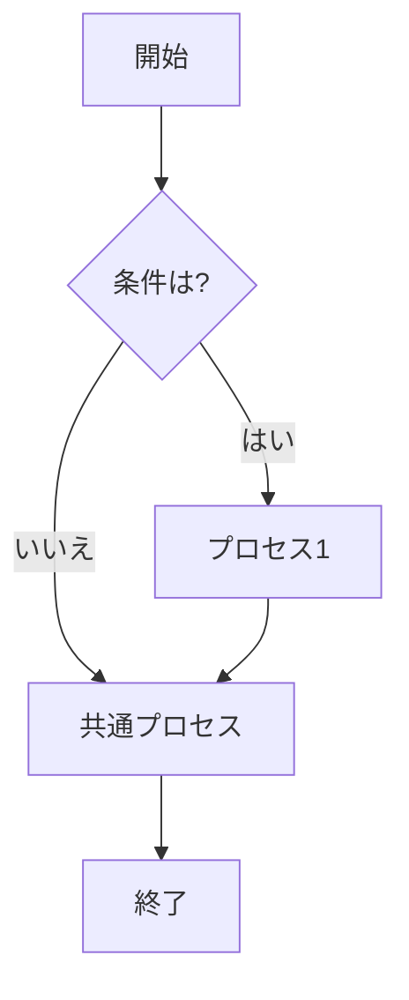
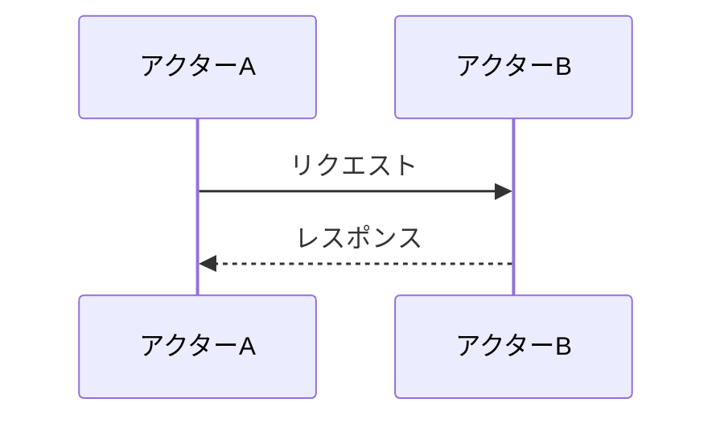
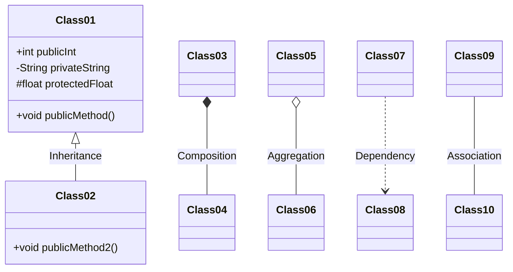

# This is sample 

## フローチャート

## シーケンス図

## クラス図
Mermaid を使用してクラス図を作成する方法について説明します。クラス図は、システムのクラス間の関係を示すUML図の一種で、属性やメソッド、そしてクラス間の関連（継承、アソシエーション、依存関係など）を表現します。

- Class01 <|-- Class02 : Inheritance は、Class01がClass02を継承していることを示します（継承）。
- Class03 *-- Class04 : Composition は、Class03がClass04を含んでおり、Class04がClass03のライフサイクルに完全に結びついていることを示します（合成）。
- Class05 o-- Class06 : Aggregation は、Class05がClass06を含んでいますが、Class06のライフサイクルがClass05から独立していることを示します（集約）。
- Class07 ..> Class08 : Dependency は、Class07がClass08に何らかの形で依存していることを示します（依存）。
- Class09 -- Class10 : Association は、二つのクラスが何らかの関連を持っていることを示します（関連）。